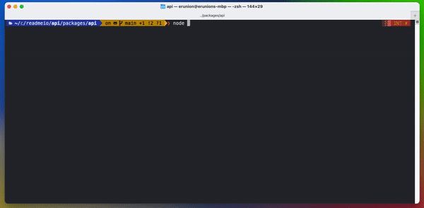
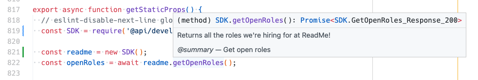

`api` can be used in two ways: a locally-installed code generated library or dynamically.

## Code generation

The code generation installation process that `api` offers comes in the form of an `api` CLI that will:

* Download and cache your OpenAPI definition into a `.api/` directory.
* Generate a full `api` library appropriate for the language you want.
  * Note that only TypeScript and JavaScript (targeting CommonJS or ECMAScript) are available right now but more languages are planned for the future. ✨
* Install necessary packages required for the generated library to run.
* Install a `@api/your-api` package in your local `package.json`
  * This allows you to use the library with `require('@api/your-api')` or `import '@api/your-api'`.



Once you have your library generated and installed you can use your SDK like you would any other:

```js
const SDK = require('@api/petstore');

const petstore = new SDK();
petstore.listPets().then(res => {
  console.log(`My pets name is ${res[0].name}!`);
});
```

And you get the benefit of having autogenerated TypeScript types to help you out regardless if you're actually using TypeScript!



## Dynamically

If you don't wish to use code generation you can load `api` and supply it an OpenAPI definition directly:

```js
const petstore = require('api')('https://raw.githubusercontent.com/readmeio/oas-examples/main/3.0/json/petstore.json');

petstore.listPets().then(res => {
  console.log(`My pets name is ${res[0].name}!`);
});
```

The OpenAPI definition is automatically downloaded, cached, and transformed into a chainable [`fetch`](https://developer.mozilla.org/en-US/docs/Web/API/Fetch_API) Promise that you can use to make API requests.

> ℹ️
>
> By using the dynamic, non-code generation, version of `api` you will not have access to any TypeScript types to assist you in using an API.

> ⚠️
>
> Using the dynamic version version of `api` will also gate you off you from using the library in a browser as the dynamicness version of `api` requires access to a filesystem to load cached OpenAPI definition needed for the library to work.
